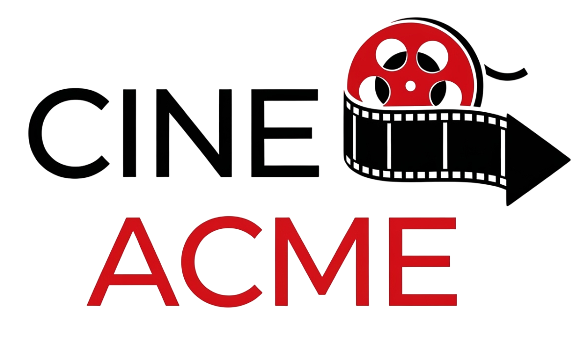

# Gestión de Cines Acme



## 📜 Descripción del Proyecto

**Gestión de Cines Acme** es una aplicación web full-stack diseñada para administrar de manera integral las operaciones de una cadena de cines. La plataforma permite a los administradores gestionar sucursales (cines), salas, el catálogo de películas, las funciones programadas y los usuarios del sistema.

El proyecto está construido con un backend robusto basado en Node.js y Express, siguiendo una arquitectura MVC (Modelo-Vista-Controlador), y una base de datos no relacional con MongoDB. El frontend es una aplicación de una sola página (SPA) dinámica, construida con HTML, CSS y JavaScript nativo, que consume la API RESTful del backend para todas sus operaciones.

## ✨ Características Principales

* **Gestión de Entidades (CRUD):** Interfaz completa para crear, leer, editar y eliminar Cines, Salas, Películas y Usuarios.
* **Programación de Funciones:** Sistema para crear y eliminar funciones, con una lógica de validación avanzada que previene conflictos de horarios en una misma sala.
* **Autenticación y Seguridad:** Sistema de autenticación basado en JSON Web Tokens (JWT). Todas las rutas de la API, a excepción del login y registro, están protegidas.
* **API de Reportes:** Endpoints especializados para generar reportes, como funciones disponibles por cine/película y proyecciones en un rango de fechas.
* **Interfaz de Usuario Moderna:** Un dashboard administrativo limpio, responsivo y fácil de usar, diseñado con un enfoque en la experiencia de usuario.

## 🛠️ Tecnologías Utilizadas

### Backend
* **Node.js:** Entorno de ejecución de JavaScript.
* **Express.js:** Framework para la construcción de la API RESTful.
* **MongoDB:** Base de datos NoSQL para la persistencia de datos.
* **jsonwebtoken (JWT):** Para la generación de tokens de autenticación.
* **bcrypt:** Para el hasheo y la seguridad de las contraseñas.
* **express-validator:** Para la validación de los datos de entrada en la API.
* **dotenv:** Para la gestión de variables de entorno.

### Frontend
* **HTML5, CSS3, JavaScript (ES Modules):** La base de la interfaz de usuario.
* **Font Awesome:** Para la iconografía del dashboard.

### Herramientas de Desarrollo
* **Nodemon:** Para el reinicio automático del servidor en desarrollo.
* **Postman:** Para la prueba y verificación de los endpoints de la API.

## 🚀 Instalación y Ejecución

Sigue estos pasos para ejecutar el proyecto en tu entorno local.

### Prerrequisitos
* Tener instalado [Node.js](https://nodejs.org/) (versión 18 o superior).
* Tener instalado y corriendo [MongoDB Community Server](https://www.mongodb.com/try/download/community).

### Pasos
1.  **Clona el repositorio:**
    ```bash
    git clone [https://github.com/tu_usuario/tu_repositorio.git](https://github.com/tu_usuario/tu_repositorio.git)
    cd tu_repositorio
    ```

2.  **Instala las dependencias del proyecto:**
    ```bash
    npm install
    ```

3.  **Configura las variables de entorno:**
    * Crea un archivo llamado `.env` en la raíz del proyecto.
    * Copia y pega el siguiente contenido, ajustando los valores si es necesario:
        ```env
        PORT=3000
        HOSTNAME=localhost
        MONGO_URI=mongodb://127.0.0.1:27017/CineAcme
        JWT_SECRET=una_clave_secreta_muy_larga_y_segura
        ```
    * **Importante:** Cambia `JWT_SECRET` por una frase secreta larga y aleatoria.

4.  **Ejecuta la aplicación en modo de desarrollo:**
    ```bash
    npm run dev
    ```
    El servidor se iniciará y estará escuchando en `http://localhost:3000`.

5.  **Accede a la aplicación:**
    * Abre tu navegador y ve a `http://localhost:3000`.
    * Serás recibido por la página de inicio, donde puedes iniciar sesión.
    * **Usuario de prueba por defecto:**
        * **Email:** `prueba@acme.com`
        * **Contraseña:** `123456`

## 📚 Documentación de la API

Todas las rutas (excepto `/api/auth`) requieren un `Bearer Token` en el header `Authorization`.

---

### Autenticación ` /api/auth `
* **`POST /register`**: Registra un nuevo usuario (desde la página pública).
* **`POST /login`**: Autentica a un usuario y devuelve un token JWT.

---

### Gestión de Usuarios ` /api/users `
* **`GET /`**: Obtiene una lista de todos los usuarios.
* **`GET /:id`**: Obtiene los detalles de un usuario específico.
* **`POST /`**: Crea un nuevo usuario (desde el dashboard).
* **`PUT /:id`**: Actualiza un usuario existente.
* **`DELETE /:id`**: Elimina un usuario.

---

### Gestión de Cines ` /api/cines `
* **`GET /`**: Obtiene una lista de todos los cines.
* **`GET /:id`**: Obtiene los detalles de un cine específico.
* **`POST /`**: Crea un nuevo cine.
* **`PUT /:id`**: Actualiza un cine existente.
* **`DELETE /:id`**: Elimina un cine.

---

### Gestión de Salas ` /api/cines/:cineId/salas `
* **`GET /`**: Obtiene las salas de un cine específico.
* **`POST /`**: Crea una nueva sala para un cine.
* **`PUT /:id`**: Actualiza una sala.
* **`DELETE /:id`**: Elimina una sala.

---

### Gestión de Películas ` /api/peliculas `
* **`GET /recent`**: Obtiene las últimas 3 películas añadidas.
* **`GET /`**: Obtiene una lista de todas las películas.
* **`GET /:id`**: Obtiene los detalles de una película específica.
* **`POST /`**: Crea una nueva película.
* **`PUT /:id`**: Actualiza una película.
* **`DELETE /:id`**: Elimina una película.

---

### Gestión de Funciones ` /api/funciones `
* **`GET /`**: Obtiene una lista detallada de todas las funciones programadas.
* **`POST /`**: Crea una nueva función, validando conflictos de horario.
* **`DELETE /:id`**: Elimina una función.

---

### Reportes ` /api/reportes `
* **`GET /funciones-disponibles`**: Retorna funciones futuras para un cine y película.
    * Query Params: `cineId`, `peliculaId`.
* **`GET /peliculas-por-fecha`**: Retorna las películas con funciones en una fecha y cine.
    * Query Params: `cineId`, `fecha` (YYYY-MM-DD).
* **`GET /proyecciones-por-rango`**: Retorna un reporte de proyecciones en un rango de fechas.
    * Query Params: `fechaInicio` (YYYY-MM-DD), `fechaFin` (YYYY-MM-DD).
